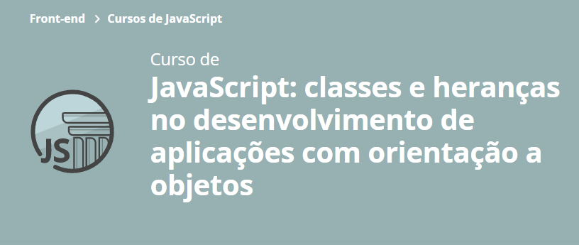

# Site DevDragons
- HTML & CSS
- JavaScipt
- Classes
- Orientação a Objetos

## Classes e heranças no desenvolvimento de aplicações com orientação a objetos
### Aula 1:
- `Class`: Criar classes no JavaScript; :white_check_mark:
- `Import` e `Export`: Importar e exportar módulos; :white_check_mark:
- `New`: Instanciar um objeto de uma Classe; :white_check_mark:
- Uso da palavra chave `This`. :white_check_mark:
### Aula 2:
- Criar um Constructor para a Classe; :white_check_mark:
- Atributos que são definidos por parâmetros e fora dos parâmetros; :white_check_mark:
- Como renderizar uma instância na página; :white_check_mark:
- Model x View. :white_check_mark:
### Aula 3:
- Utilizar extends e super na herança; :white_check_mark:
- Sobrescrever métodos com polimorfismo; :white_check_mark:
- Utilizar parte de uma classe em outra com composição. :white_check_mark:
### Aula 4:
- Criar e acessar propriedades estáticas; :white_check_mark:
- Criar e acessar métodos estáticos. :white_check_mark:
### Aula 5:
- Utilizar encapsulamento e criar propriedades privadas; :white_check_mark:
- Criar o método get para retornar o valor de uma propriedade privada; :white_check_mark:
- Empregar o método set para alterar o valor de uma propriedade privada. :white_check_mark:

## Rodar o projeto

Utilize o plugin liveServer do vscode
